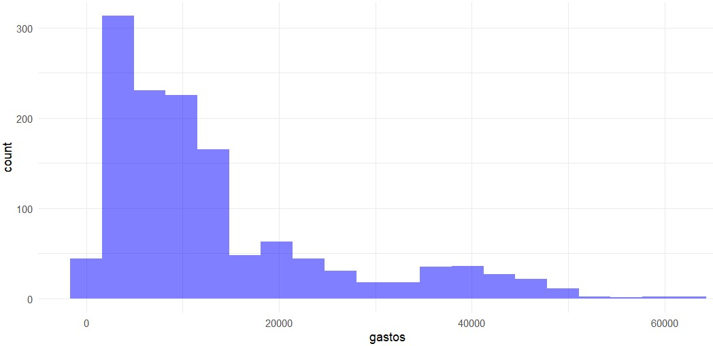
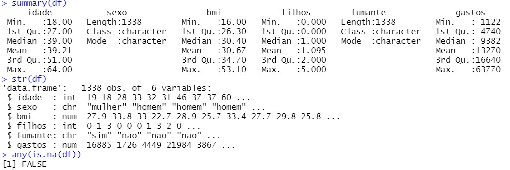
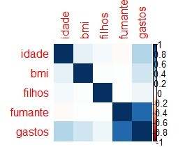
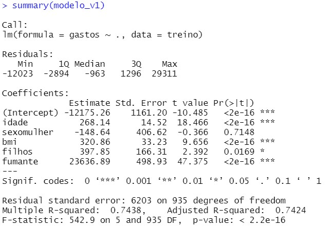
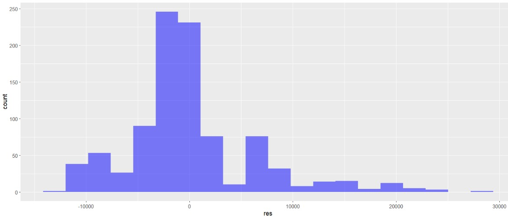
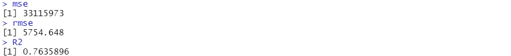
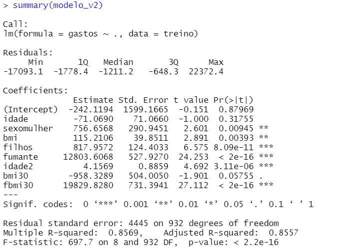
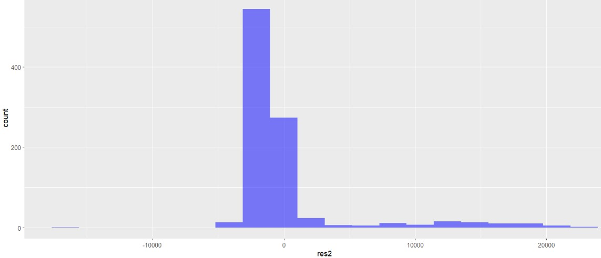

<h1 align="middle">Prevendo Despesas Médicas 👩‍⚕️️🏥</h1>

<p align="center">
  
</p>

# Índice
* [Sobre o Projeto](#computer-sobre-o-projeto)
* [Descrição Geral do Problema](#gear-descrição-geral-do-problema)
* [Familiarizando-se com o Dataset](#mag-familiarizando-se-com-o-dataset)
  * [Suposições de negócio](#suposições-de-negócio)
  * [Exploração inicial dos dados](#exploração-inicial-dos-dados)
  * [3 relevant insights](#3-relevant-insights)
  * [Financial results](#financial-results)
  * [Conclusion](#conclusion)
* [Technologies](#hammer_and_wrench-technologies)
* [Setup](#rocket-setup)
  * [Requirements](#requirements)
  * [Installation](#wrench-installation)
  * [Executing online](#globe_with_meridians-executing-online)
  * [Executing via cmd](#game_die-executing-via-cmd)
* [Author](#superhero-author)

## :computer: Sobre o Projeto
<td><p align=justify>O objetivo deste projeto é praticar o conhecimento adquirido em Machine Learning. Para o desenvolvimento do projeto foi utilizada linguagem R (versão 4.2.0) juntamente com as bibliotecas 'dplyr' (versão 1.0.9), 'ggplot2' (versão 3.3.6), 'corrplot' (versão 0.92) e 'caTools' (versão 1.18.2).</p></td>

## :gear: Descrição Geral do Problema
<td><p align=justify>Para que uma companhia de seguros de saúde possa auferir lucros, ela precisa recolher mais
prêmios anuais do que gasta em cuidados médicos para os seus beneficiários. Como resultado,
as seguradoras investem no desenvolvimento de modelos que possam prever com precisão as 
despesas médicas para a população segurada. As despesas médicas são difíceis de estimar, 
porque os tratamentos mais caros são raros e, aparentemente, ocorrem de maneira aleatória. 
Ainda assim, algumas condições são mais comuns em certos segmentos da população. Por exemplo, 
o câncer de pulmão é mais provável entre fumantes do que não-fumantes e doenças cardíacas podem 
ser mais prováveis entre os obesos. O objetivo deste projeto é usar os dados de pacientes para estimar 
as despesas médias de assistência médica a esses segmentos da população. Estas estimativas podem ser utilizadas
para criar tabelas que estabelecem os preços dos prêmios anuais maiores ou menores, dependendo dos custos de tratamento previsto.</p></td>

## :mag: Familiarizando-se com o Dataset
<td><p align=justify>Para o desenvolvimento do Projeto foram utilizados dados fictícios de 1338 segurados, considerando as seguintes caracterísicas: idade, sexo, 
índice de massa corporal (bmi), número de filhos, se é fumante ou não, e o total anual gasto com despesas médicas.</p></td>

- [x] **Suposições de negócio**: Trabalharemos inicialmente com a hipótese de que algumas caractéricas dos segurados, como ser fumante e/ou 
possuir um alto índice de massa corporal estão diretamente vinculadas aos gastos anuais com saúde.
- [x] **Exploração inicial dos dados**: Resumo estatístico, Tipos de variáveis e verificação se há valores 'missing'.
<p align="center">
<i>Primeiras linhas do 'dataset'</i>
</p>
<p align="center">
  
</p>
<p align="center">
<i>Histograma da variável 'gastos'</i>
</p>
<p align="center">
  
</p>
<p align="center">
<i>Resumo estatístico</i>
</p>
<p align="center">
  
</p>

- [x] **Pré-Processamento**: 

Substituindo 'sim' e 'nao' por 1 e 0 respectivamente na coluna 'fumante'.
```
df$fumante = ifelse(df$fumante == "sim",1,0)
df$fumante = as.numeric(df$fumante)
```
Obtendo e filtrando apenas as colunas numéricas para análise de correlacão.
```
colunas_numericas <- sapply(df, is.numeric)
data_cor <- cor(df[,colunas_numericas])
```
- [x] **Análise da Correlação entre as variáveis**: 

<p align="center">
<i>Matriz de Correlação</i>
</p>
<p align="center">
  
</p>

```
corrplot(data_cor, method = 'color')
```

<p align="center">
  
</p>

<td><p align=justify>Como podemos observar, existe correlação entre a variável "gastos" e as demais variáveis, sendo a correlação com a variável "fumante" a mais forte. <b>Isso confirma a hipótese inicial de que algumas características dos segurados podem influenciar em seu gasto anual com despesas médicas.</b></p></td>

## :rocket: Solução do Problema
Uma vez que concluímos as etapas de exploração dos dados e pré-processamento, confirmando ainda nossa hipótese inicial de que há correlação entre os atributos dos segurados e o seu gasto anual com despesas médicas, buscaremos agora uma solução para o problema inicialmente proposto: **estimar as despesas médias dos segurados com base nos seus atributos**. Para isso entendemos como necessária a construção de um modelo preditivo, neste caso utilizaremos a **Regressão Linear** para estimar os valores.

### Construindo o Modelo 

Criando as amostras de forma randomica
```
amostra <- sample.split(df$idade, SplitRatio = 0.70)
```
Criando dados de treino - 70% dos dados
```
treino = subset(df, amostra == TRUE)
```
Criando dados de teste - 30% dos dados
```
teste = subset(df, amostra == FALSE)
```
Gerando o Modelo com dados de treino (Usando todos os atributos)
```
modelo_v1 <- lm(gastos ~ ., data = treino)
```

Podemos observar que o modelo criado apresenta bom desempenho utilizando os dados de treino (tomando como parâmetro o R-squared).



Obtendo os resíduos (diferenca entre os valores observados de uma variavel e seus valores previstos)
```
res <- residuals(modelo_v1)
res <- as.data.frame(res)
```

Histograma dos resíduos
```
ggplot(res, aes(res)) +  
  geom_histogram(bins = 20, 
                 alpha = 0.5, fill = 'blue')
```



O Histograma acima nos mostra uma distribuicao normal, o que indica que a média entre os valores previstos e os valores observados é proximo de zero, o que é muito bom.

### Testando e avaliando o Modelo 

Fazendo as predições com os dados de teste
```
prevendo_gastos <- predict(modelo_v1, teste)
resultados <- cbind(prevendo_gastos, teste$gastos) 
colnames(resultados) <- c('Previsto','Real')
resultados <- as.data.frame(resultados)
```

Tratando os valores negativos
```
trata_zero <- function(x){
  if  (x < 0){
    return(0)
  }else{
    return(x)
  }
}
resultados$Previsto <- sapply(resultados$Previsto, trata_zero)
```

Cálculo da raiz quadrada do erro quadrático médio
```
mse <- mean((resultados$Real - resultados$Previsto)^2)
rmse <- mse^0.5
```

Cálculo do R-squared (O R² ajuda a avaliar o nivel de precisão do modelo, quanto maior, melhor, sendo 1 o valor ideal)
```
SSE = sum((resultados$Previsto - resultados$Real)^2)
SST = sum( (mean(df$gastos) - resultados$Real)^2)
R2 = 1 - (SSE/SST)
```



Analisando as métricas calculadas acima, **concluímos que o modelo apresenta bom desempenho nas predições**. No entanto, é importante sempre avaliar se a performance apresentada pode ser melhorada, é o que faremos na próxima etapa do projeto!

### Otimizando o Modelo

Nesta etapa tentaremos otimizar a performance do Modelo construído. Antes de efetuar qualquer alteração precisamos analisar alguns pontos importantes referentes às nossas variáveis preditoras (atributos dos segurados).

1 - Idade: É notório que os gastos com saúde tendem a aumentar de maneira desproporcional para a população mais velha. Logo, é interessante acrescentar uma variável que nos permita separar o impacto linear e não linear da idade nos gastos. Isso pode ser feito criando a variável 'idade²' (idade ao quadrado).

2 - Índice de massa corporal (BMI): Outra observação a ser feita é com relação às pessoas obesas (BMI >= 30), a obesidade pode ser um preditor importante para os gastos com saúde, uma vez que as pessoas obesas tendem a desenvolver mais doenças. Neste caso podemos acrescentar uma variável 'bmi30' que indique se o segurado é obeso ou não (1 ou 0);

3 - Uma vez que criamos a variável 'bmi30' que indica se o segurado é obeso ou não, e considerando que a variável 'fumante' é um forte preditor dos gastos (conforme análise da matriz de correlação na seção 'Familiarizando-se com o Dataset') podemos criar uma outra variável (cujo nome será 'fbmi30') que contemple os segurados que são obesos e ao mesmo tempo fumantes. Neste caso 'fbmi30' = bmi30*fumante, onde '1' indicará se as duas condições estão presentes e '0' se uma ou nenhuma das condições está presente.

Acrescentando variáveis 'idade2', 'bmi30' e 'fbmi30' aos dados de treino e teste
```
treino$idade2 <- (treino$idade)^2
teste$idade2 <- (teste$idade)^2
treino$bmi30 <- ifelse(treino$bmi >= 30, 1, 0)
teste$bmi30 <- ifelse(teste$bmi >= 30, 1, 0)
treino$fbmi30 <-treino$bmi30*treino$fumante
teste$fbmi30 <-teste$bmi30*teste$fumante
```

Criando Modelo Otimizado
```
modelo_v2 <- lm(gastos ~ ., data = treino)
```



Histograma dos resíduos
```
res2 <- residuals(modelo_v2)
res2 <- as.data.frame(res2)
ggplot(res2, aes(res2)) +  
  geom_histogram(bins = 20, 
                 alpha = 0.5, fill = 'blue')
```



Após repetir os passos de testagem e avaliação do Modelo Otimizado obtemos novamente as métricas:


Como o podemos observar o Modelo Otimizado apresentou significativa melhora no desempenho das predições.

### Conclusão e Considerações finais

Após passar pelas etapas de exploração e pré-processamento dos dados, construção, treinamento e otimização do Modelo Preditivo, concluímos nosso trabalho, tendo encontrado através de um modelo baseado em Regressão Linear a solução para o problema proposto, as próximas etapas passariam pela entrega dos resultados às equipes responsáveis pelo desenvolvimento e implantação de um sistema que receba novos dados, e baseada no modelo preditivo proposto, devolva as previsões em formato adequado. Tais informações seriam de extrema utilidade para os setores responsáveis pelo planejamento e gestão financeira da empresa. Obviamente que o modelo construído, mesmo otimizado, ainda passaria por ajustes finos e constantes melhorias, de modo a obter sempre o melhor desempenho.
